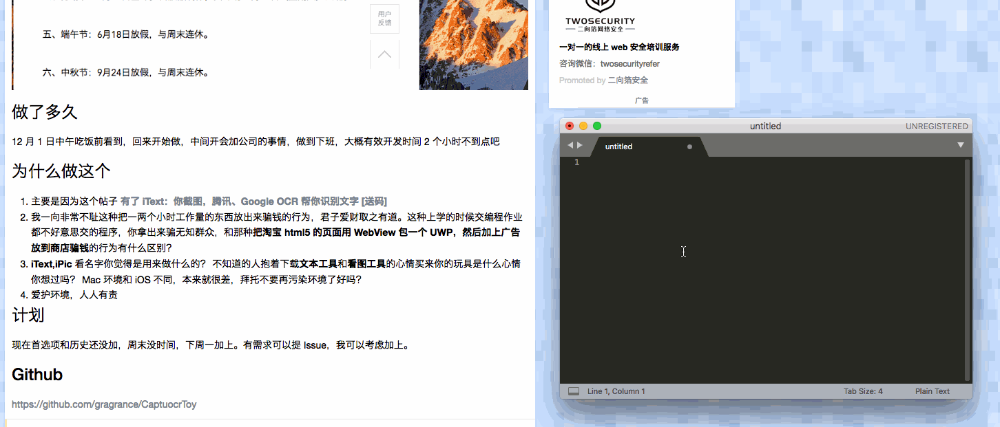

# Alfred-OCR

## 用法

在 release 下载 .workflow 文件，双击安装（需要 Alfred Powerpack）。

唤醒 Alfred，输入 OCR，回车确定，截图。稍等几秒（视网速而定），粘贴即可。

## 致谢

谢谢 nannanziyu 在 https://www.v2ex.com/t/411218 提供的想法。本插件也使用了他公布的百度 API KEY。

感谢 https://github.com/ginfuru/alfred-screen-capture ，我在其中找到了调用 Mac 截图的方法，也偷懒使用了他的图标。
 
